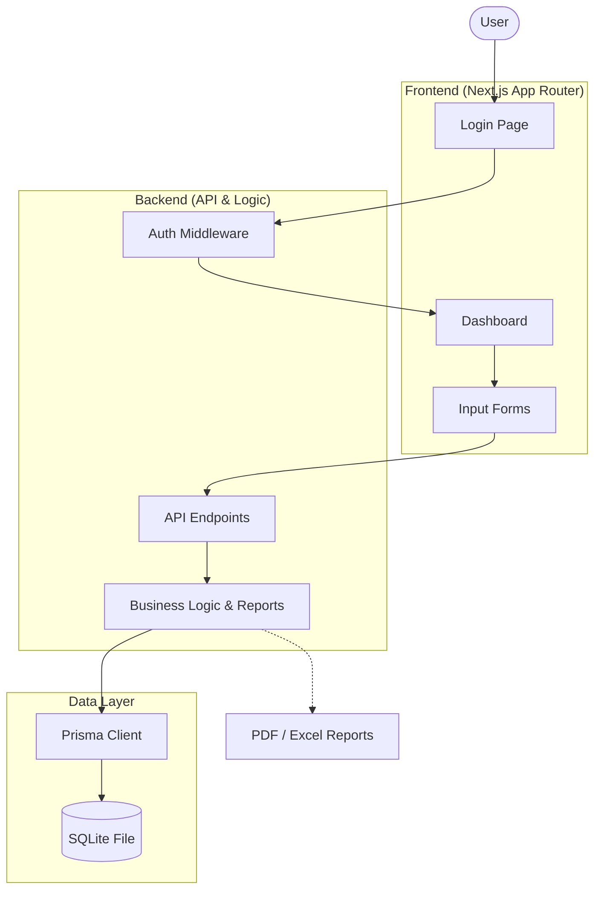

# Automated Training Report: System Architecture & Flow

This document provides a clear technical overview of the system for presentation and documentation purposes.

## 1. Technological Stack

### **Frontend (The User Interface)**
*   **Framework**: [Next.js](https://nextjs.org/) (Version 16+) using the **App Router Architecture**. This is the industry standard for high-performance React applications.
*   **Language**: **TypeScript**. Provides static typing, making the code more robust and easier to maintain.
*   **Styling**: **Tailwind CSS**. A utility-first CSS framework used to create the premium, responsive layout.
*   **Icons**: **Lucide React**. High-quality, scalable vector icons.

### **Backend (The Logic Layer)**
*   **Runtime**: **Node.js** via Next.js Serverless Functions (API Routes). This handles the processing of data without needing a separate server.
*   **Authentication**: Custom session-based authentication with role-based access control (**Admin** vs. **Staff**).
*   **Emailing**: **Nodemailer** (via Gmail SMTP) for automated notifications and password resets.

### **Database (The Storage Layer)**
*   **Database Engine**: **SQLite**. A file-based SQL database, perfect for portability and medium-scale applications.
*   **ORM (Object-Relational Mapping)**: **Prisma**. Acts as a powerful interface between the code and the database, ensuring "type-safe" database queries.

### **Reporting Utilities**
*   **PDF Generation**: `jspdf` and `jspdf-autotable`.
*   **Excel Export**: `xlsx` (SheetJS).

---

## 2. System Flow Diagram

---

## 3. Core Features Workflow

### **A. User Lifecycle**
1.  **Registration**: New users sign up; accounts are initially **PENDING**.
2.  **Admin Approval**: An Admin user reviews and approves the registration via the **User Management** panel.
3.  **Access**: Once approved, users can log in and access features based on their role.

### **B. Training Lifecycle**
1.  **Creation**: A Staff member fills out the **New Training Form**.
2.  **Submission**: Training is saved with a **PENDING** status.
3.  **Review**: Admin reviews the training details and approves it.
4.  **Completion**: Participants are added, attendance is tracked, and feedback is recorded.
5.  **Output**: The system compiles all data into a one-click **Automated Report** (PDF or Excel).

---

## 4. Why This Matters (Key Selling Points)
1.  **Automation**: Replaces manual paper-trail reporting, saving hours of administrative work.
2.  **Reliability**: Using **TypeScript** and **Prisma** prevents many common runtime errors.
3.  **Performance**: **Next.js** ensures the site loads instantly and feels snappy for the user.
4.  **Security**: Passwords are never stored in plain text (uses **bcryptjs**), and routes are protected by server-side middleware.
